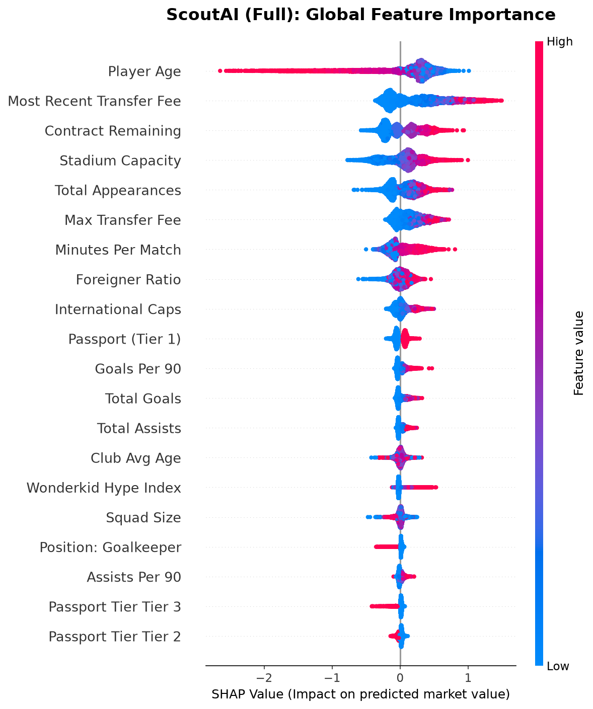
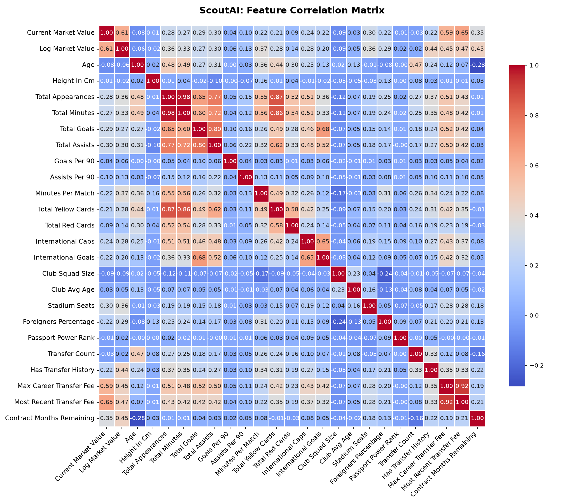
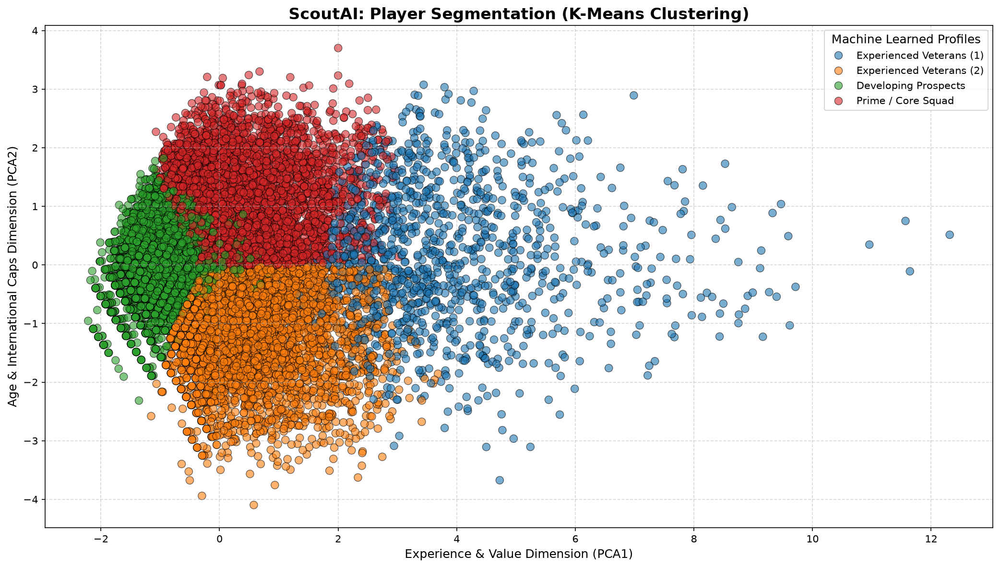
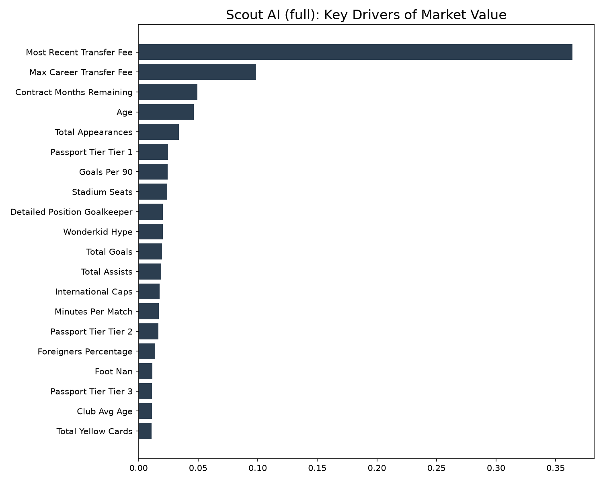
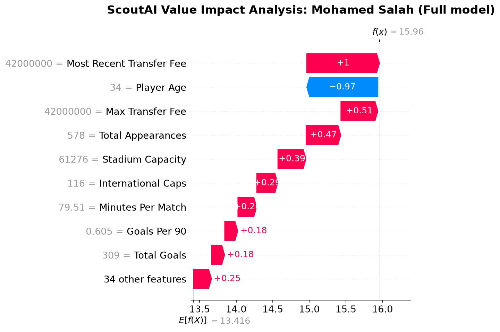

# ⚽ Scout AI — Football Player Market Value Prediction & Opportunity Detection

Scout AI is an end-to-end machine learning project that predicts professional football players' market values and identifies potentially undervalued talents through an **Opportunity Mode**.

The project combines data analysis, model optimization, explainable AI, clustering, and interactive scouting tools into a complete football analytics pipeline.

---



---

# 📊 Model Performance

Both models were hyperparameter-tuned via `RandomizedSearchCV` (5-fold CV, log-RMSE objective).

| Model | RMSE (old → new) | R² (old → new) | 5-Fold CV Log-RMSE |
|---|---|---|---|
| **Full** | €4,022,706 → **€3,848,864** | 0.6992 → **0.7246** | 0.7921 |
| **Performance Only** | €3,883,840 → **€3,763,374** | 0.7196 → **0.7367** | 0.8491 |

Tuning reduced RMSE by ~€174K (full) and ~€120K (performance-only), with both models clearing R² > 0.72 on held-out data. Full tuning logs and best hyperparameters are in [`notebooks/data/tuning_results_log.txt`](notebooks/data/tuning_results_log.txt).

---

# 🚀 Features

* Predict football player market values using **XGBoost**
* Dual-model architecture to reduce market bias
* Hyperparameter optimization
* SHAP explainability analysis
* Prediction error & residual analysis
* Player similarity clustering (K-Means)
* Undervalued player detection
* Individual player valuation
* Club scouting interface
* Interactive scouting reports

---

# 📁 Project Structure

```
ScoutAI/
│
├── README.md
├── requirements.txt
├── .gitignore
├── .env.example
│
├── sql/
│   └── 00_setup_views.sql
│
├── dashboard/                 # planned: standalone visualization app
│
└── notebooks/
    ├── 01_eda_and_correlation.ipynb
    ├── 02_scout_ai_model.ipynb
    ├── 03_hyperparameter_tuning.ipynb
    ├── 04_shap_analysis.ipynb
    ├── 05_error_analysis.ipynb
    ├── 06_residual_analysis.ipynb
    ├── 07_kmeans_clustering.ipynb
    ├── 08_scoutai_undervalued_analysis.ipynb
    ├── 09_specific_player_value.ipynb
    ├── 10_player_impact_analysis.ipynb
    ├── 11_club_scouting_recommendations.ipynb
    │
    ├── models/
    │   ├── scout_model_full.pkl              # production model (post-tuning)
    │   ├── scout_model_performance_only.pkl  # production model (post-tuning)
    │   ├── scout_model_full_old.pkl              # pre-tuning, kept for comparison
    │   └── scout_model_performance_only_old.pkl  # pre-tuning, kept for comparison
    │
    ├── data/
    │   ├── *.csv
    │   └── *.txt
    │
    └── images/
        └── *.png
```

---

# ⚙️ Installation

Clone the repository:

```bash
git clone https://github.com/yourusername/ScoutAI.git
cd ScoutAI
```

Install the required packages:

```bash
pip install -r requirements.txt
```

Set up the PostgreSQL database. Load the source tables (`players`,
`appearances`, `clubs`, `competitions`, `transfers`, `player_valuations`,
`national_teams`), then create the views the notebooks read from:

```bash
psql -d <dbname> -f sql/00_setup_views.sql
```

Create your environment file and fill in your database connection string:

```bash
cp .env.example .env
```

---

# ▶️ Workflow

Execute the notebooks in numerical order.

### 0. Exploratory Data Analysis (optional)

```
01_eda_and_correlation.ipynb
```

Correlation matrix and initial feature exploration. Not required for the
pipeline to run, but useful to understand the data first.

### 1. Train the Models

```
02_scout_ai_model.ipynb
```

This notebook trains both production models.

---

### 2. Hyperparameter Optimization

```
03_hyperparameter_tuning.ipynb
```

If the tuned model beats the existing one, it overwrites the production
model files:

```
scout_model_full.pkl
scout_model_performance_only.pkl
```

The previous versions are kept as `scout_model_full_old.pkl` and
`scout_model_performance_only_old.pkl` for reference/comparison.

---

### 3. Analysis Pipeline

Continue executing:

```
04 → SHAP Analysis

05 → Error Analysis

06 → Residual Analysis

07 → K-Means Player Clustering

08 → Opportunity Mode (Undervalued Players)

09 → Specific Player Valuation

10 → Player Impact Analysis

11 → Interactive Club Scouting
```

---

# 📂 Generated Outputs

The notebooks automatically export results into dedicated folders.

### `notebooks/images/`

* SHAP plots
* Residual plots
* Correlation heatmaps
* Feature importance charts
* Cluster visualizations

<table>
<tr>
<td><br/><sub>Feature correlation matrix</sub></td>
<td><br/><sub>Player segmentation (K-Means)</sub></td>
</tr>
<tr>
<td><br/><sub>Feature importance — full model</sub></td>
<td><br/><sub>SHAP waterfall — individual player example</sub></td>
</tr>
</table>

### `notebooks/data/`

* Transfer recommendations
* Error reports
* Model outputs
* CSV exports
* Generated scouting tables

---

# 🧠 Why Two Models Instead of One?

During early development, Scout AI used a single XGBoost model trained on **every available feature**, including market-driven variables such as:

* Previous transfer fees
* Contract length
* Existing market valuation signals

Although this achieved high prediction accuracy, the model was effectively learning to reproduce the market's existing valuation rather than discovering hidden talent.

To overcome this issue, Scout AI adopts a **dual-model architecture**.

| Model                                 | Features                                                      | Intended Use                                                                                          |
| -------------------------------------- | -------------------------------------------------------------- | -------------------------------------------------------------------------------------------------------- |
| **scout_model_full.pkl**               | Performance + market-signal features                          | Accurate valuation for established players with transfer history                                     |
| **scout_model_performance_only.pkl**   | Performance, biographical information and club context only  | Detecting undervalued players while avoiding bias introduced by transfer history or zero-fee records |

This separation enables the project to provide both accurate market value estimation and meaningful scouting recommendations.

---

# 📈 Example Opportunity Mode Results

| Player  | Position     | Club         | Current Value | Scout AI Prediction | Difference |
| ------- | ------------ | ------------ | -------------- | -------------------- | ---------- |
| Gavi    | Midfielder   | FC Barcelona | €30M           | €99.8M                | **+232%**  |
| Rodrygo | Right Winger | Real Madrid  | €45M           | €63.5M                | **+41%**   |

*(Figures pulled from `notebooks/data/undervalued_gems_report.txt` — update this table if you retrain the models, since predictions will shift.)*

---

# 🛠️ Tech Stack

* Python
* Pandas
* NumPy
* PostgreSQL / SQLAlchemy
* Scikit-learn
* XGBoost
* SHAP
* Matplotlib
* Seaborn
* Jupyter Notebook

---

# 🎯 Project Goal

Scout AI aims to support football scouting and recruitment by combining predictive machine learning with explainable AI techniques.

Rather than simply estimating market prices, the system is designed to identify players whose on-field performance suggests they may be significantly undervalued in the transfer market.
